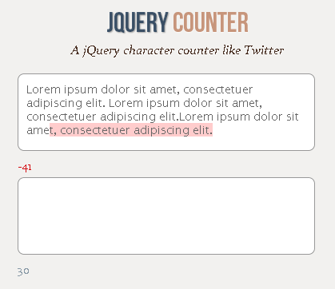

# jQuery Counter v0.1.0 #

A jQuery plugin which provide character counter similar to Twitter. 
Used jQuery plugin boilerplate from [JONATHAN NICOL](http://jonathannicol.com/blog/2012/05/06/a-jquery-plugin-boilerplate/) :) Thanks!

### Installation
Include script after the jQuery library

    

### Usage

__html__    
    
    

__jQuery__   
    
    $('.tweet').counter();

### Options

~~~

$('#tweet-template').counter({
	limit: 			140,
	limitWarning: 	25,
	limitElement: 	'span',
	counterClass:   'counter',		
	limitClass: 	'limit',		
	warningClass: 	'warning',
	exceededClass: 	'exceeded',
	format: 		'%1'
});

~~~

 * __limit__: Maximum character count. _Default 140_
 * __limitWarning__: Number indicate where warning limit is on. _Default 25_
 * __limitElement__: Inline HTML element to show the left numbers of characters. _Default span_
 * __counterClass__: Class to decorate counter element . _Default counter_
 * __limitClass__: Class to decorate limit element. _Default limit_
 * __warningClass__: Class to decorate limit element in case of warning. _Default warning_
 * __exceededClass__: Class to decorate limit element in case of exceed of characters. _Default exceeded_
 * __format__: Format the output to show the rest of the characters. _Default %1_

### To-do ###

 * input text and textarea support
 * word count
 * Callback Support
 * Bug fixes if any
 * JSLinting & Testing

### License ###

Released under the [MIT](http://www.opensource.org/licenses/mit-license.php) license 
Copyright (c) 2014 Ravi Kumar